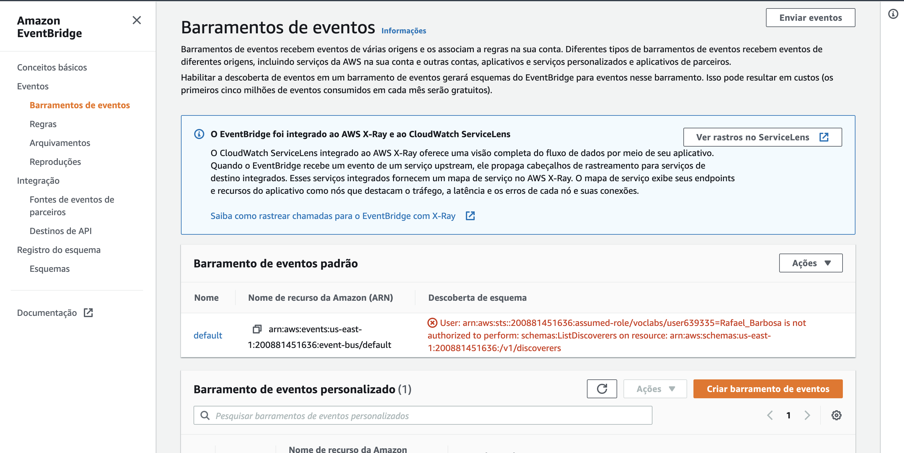
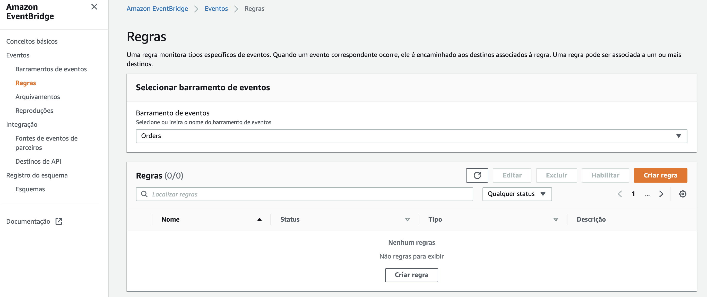
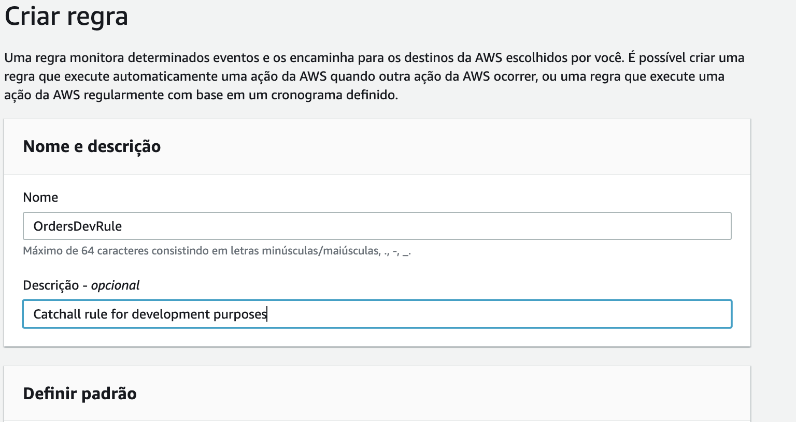
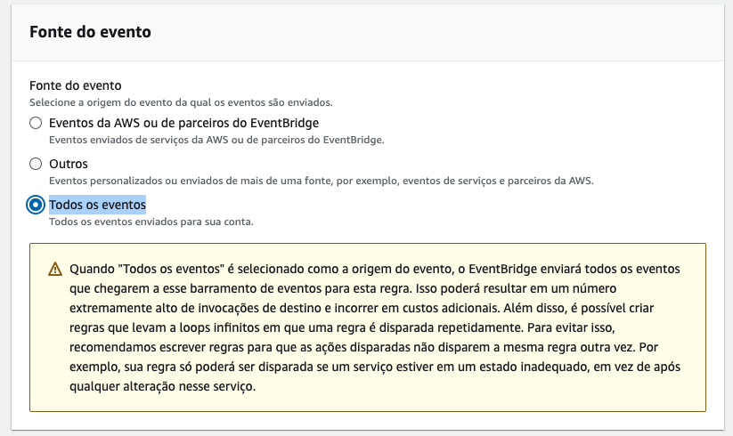
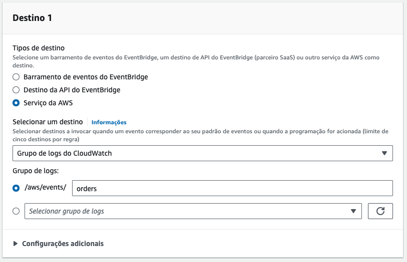
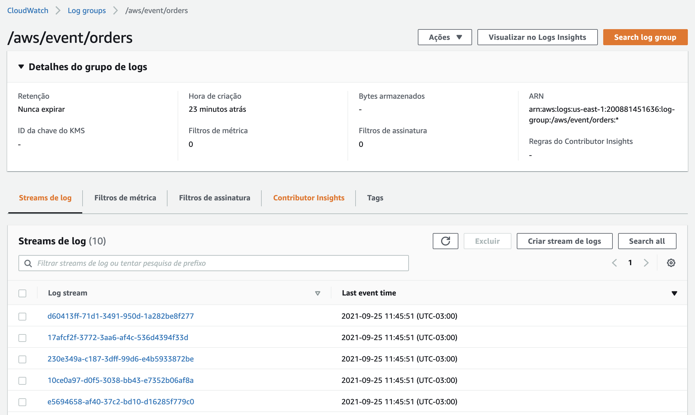
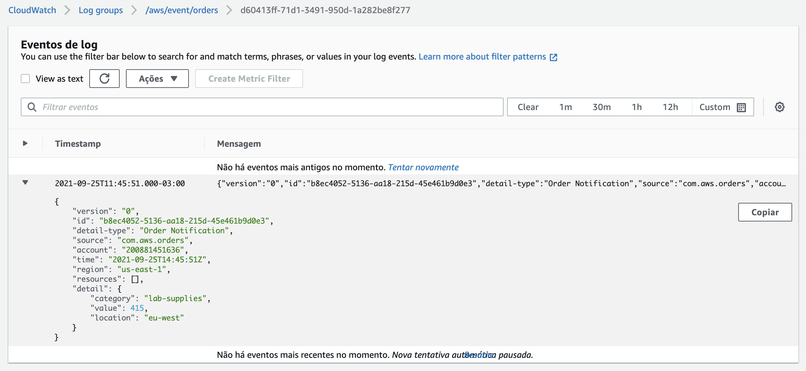
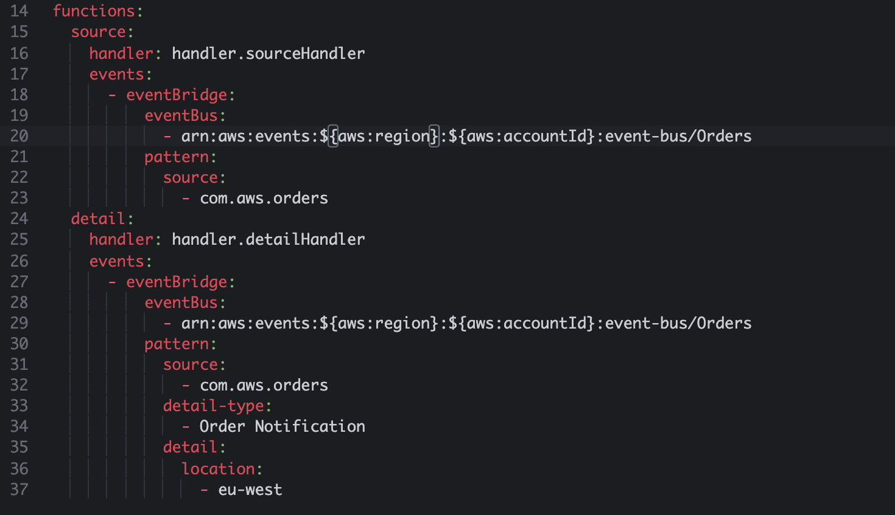

# Aula 06.1 - EventBridge

1. No terminal do IDE criado no cloud9 execute o comando `cd ~/environment/fiap-cloud-computing-tutorials/06-EventBridge/` para entrar na pasta que fara este exercicio.
2. Utilize virtualenv para esse exercicio com os comandos:
``` shell
python3 -m venv ~/venv 
source ~/venv/bin/activate
pip3 install boto3
```

1. Em uma nova aba do console aws entre no serviço [eventbridge](https://us-east-1.console.aws.amazon.com/events/home?region=us-east-1#/)
2. Do lado esquerdo da tela clique em `Barramento de eventos`
3. No canto direito inferior da tela clique em `Criar barramento de eventos` 
   
4. Coloque o nome `Orders` no barramento, deixe a política vazia e clique em `Criar`
   
5. No menu lateral esquerdo clique em `Regras`
6. Certifique-se de que o barramento `Orders` esta selectionado e clique em `Criar Regra` Para criar uma regra que irá capturar todos os eventos do barramento Orders e mandar uma log dentro do Cloudwatch Logs.
   
7. Na página de criação da regra adicione o seguinte na seção Nome e Descrição:
   1. Nome: `OrdersDevRule`
   2. Descrição: `Catch all rule for development purposes`
   
8.  Na seção Definir Padrão adicione o seguinte:
    1. Selecione `Todos os eventos`
    2. Clique em `Próximo`
   
9.  Na seção `Selecionar destinos` adicione o seguinte:
    1. Em `Destino` escolha `Grupo de logs do Cloudwatch`
    2. Em `Grupo de logs` coloque o valor `orders`
   
10. Certifique-se de que o barramento `Orders` esta selectionado na página de revisão.   
11. Clique em `Criar` ao final da página.
12. Hora de testar a regra criada. Para tal, retorne ao Cloud9.
13. Abra o arquivo putEvents.py com o comando `c9 open putEvents.py`
14. Você vai alterar o arquivo para que envie eventos para o recém criado barramento Orders. Note que o evento tem metadados como detalhe de evento, fonte e Hora, assim como o evento em si que fica em detalhe. 
15. Altere o arquivo para que fique como na imagem abaixo, não esqueça de salvar:
   
16. No terminal execute o comando `python3 putEvents.py` para enviar 10 eventos para o barramento.
17. Para conferir a regra funcionando vá para o painel do cloudwatch utilizando o link: [Cloudwatch Logs](https://us-east-1.console.aws.amazon.com/cloudwatch/home?region=us-east-1#logsV2:log-groups/log-group/$252Faws$252Fevents$252Forders)
18. Caso tudo tenha corrido corretamente terão alguns streamings como na imagem abaixo:
    
19. Clique em um dos streamings para ver o evento enviado.
    
20. Devolta ao cloud9 agora você vai criar outras 2 regras que ativaram cada uma um lambda. Isso será executado com serverless framework apontando para o barramento que criou. Para entrar na pasta correta e abrir o arquivo no IDE execute o comando:
``` shell
cd ~/environment/fiap-cloud-computing-tutorials/06-EventBridge/lambda
c9 open serverless.yml
```
1.  <strong>Adicione</strong> as 2 funções lambda conforme na imagem abaixo o serverless.yml aberto no passo anterior. A função `source` captura todos os eventos que tem o source = `com.aws.orders`, já a segunda função, `detail`, captura todos os eventos do mesmo source e adiciona os filtros por tipo de detalhe e localização.
    
2.  No terminal execute o comando `sls deploy --verbose` para fazer o deploy das funções e criar as regras no eventBridge. A opção --verbose no comando é para visualizar os passos executados pelo cloudformation durante o deploy.
3.  Publique eventos no barramento utilizando localizações diferentes utilizando o arquivo `putRandomEvents.py`. Para tal execute os comandos abaixo:
``` shell
cd ~/environment/fiap-cloud-computing-tutorials/06-EventBridge/
python3 putRandomEvents.py
```
1.  Verifique os logs dos lambdas nos seguintes links:
- [source](https://console.aws.amazon.com/cloudwatch/home?region=us-east-1#logsV2:log-groups/log-group/$252Faws$252Flambda$252Fevent-filter-dev-source)
- [detail](https://console.aws.amazon.com/cloudwatch/home?region=us-east-1#logsV2:log-groups/log-group/$252Faws$252Flambda$252Fevent-filter-dev-detail)
