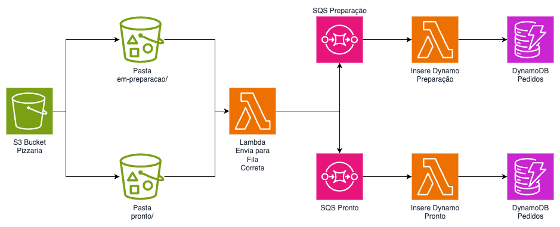

# Trabalho Final




A arquitetura apresentada na imagem descreve um fluxo de processamento de pedidos utilizando serviços da AWS para uma pizzaria. O ponto de partida é um bucket do S3, que é usado para armazenar arquivos relacionados aos pedidos de pizza. Existem duas pastas dentro deste bucket: `em-preparacao/` e `pronto/`, que representam diferentes estágios no ciclo de vida de um pedido de pizza.

Quando um arquivo de pedido é colocado na pasta `em-preparacao/`, um evento é acionado que invoca uma função AWS Lambda. Esta função tem a responsabilidade de enviar o pedido para a fila correta no Amazon Simple Queue Service (SQS). Há duas filas SQS mostradas: uma para pedidos em preparação (`SQS Preparação`) e outra para pedidos prontos (`SQS Pronto`). A função Lambda provavelmente determina o status do pedido para decidir para qual fila o pedido deve ser enviado. Depois que um pedido é colocado na pasta `pronto/` no bucket do S3, um evento semelhante dispara a mesma função Lambda ou uma função diferente para encaminhar o pedido para a fila `SQS Pronto`. Em ambos os casos, após o pedido ser colocado na fila apropriada, outra função Lambda é acionada para inserir os detalhes do pedido em uma tabela específica no Amazon DynamoDB. Há duas ações de inserção ilustradas, uma para cada estado do pedido (`Preparação` e `Pronto`), indicando que os pedidos são registrados em diferentes estágios do processo. A tabela no DynamoDB chamada `Pedidos` é usada para manter um registro persistente dos pedidos, e essa tabela pode ser acessada para consultas e gerenciamento de pedidos.


### Passos

1. Crie manualmente um novo Bucket S3, uma tabela DynamoDB e 2 filas SQS no console da AWS.
   1. S3:
      1. Nome = nome-unico-pizzaria (O nome tem que ser unico para conseguir criar o bucket)
   2. DynamoDB:
      1. Chave de partição: pedido(String)
      2. Chave de pesquisa: datetime(String)
      3. Nome: pedidos-pizzaria
   3. Fila SQS Em Preparação:
      1. Tipo: Standard
      2. Nome: em-preparacao-pizzaria
   4. Fila SQS Pronto:
      1. Tipo: Standard
      2. Nome: pronto-pizzaria
2. Crie via serverless framework o lambda que receberá os eventos do S3 e enviará as mensagens para as filas SQS.
   1. O lambda deve ser acionado por eventos do S3.
      1. O lambda terá 2 eventos de gatilho, um para cada pasta do bucket.
   2. O lambda deve enviar as mensagens para as filas SQS de acordo com a fonte do evento.
      1. Se a pasta for em-preparacao enviar para a fila em-preparacao-pizzaria
      2. Se a pasta for pronto enviar para a fila pronto-pizzaria
3. Crie o lambda que recebe as mensagens da fila em-preparacao-pizzaria e insere os dados na tabela DynamoDB. O lambda deve ser acionada a cada 1 mensagem na fila.
4. Crie o lambda que recebe as mensagens da fila pronto-pizzaria e insere os dados na tabela DynamoDB. O lambda deve ser acionada a cada 1 mensagem na fila.
5. A entrega consiste em todos os arquivos de programação e configuração gerados para provisionar os lambdas e gatilhos de evento. Faça um zip dos mesmos e submeta no portal fiap. Caso o código esteja no git é só fazer o download do zip direto no github.


### Informações e dicas

1. Pode escolher qualquer linguagem suportada pelo lambda para resolver o exercicio. Todos os exemplos estão em python3
2. Para utilizar o arquivo de testes altere a variável `bucket_name` para o nome do seu bucket.
3. Para testar o seu exercicio esta disponibilizado nesta pasta um arquivo chamado putEventsPizzaria.py que irá inserir arquivos no bucket do S3. Para testar o seu exercicio basta executar este arquivo.
4. Exemplo de item a ser inserido no DynamoDB:
   ``` json
   {
      "pedido": "1234",
      "datetime": "2024-09-23T15:35:41Z",
      "cliente": "rafael",
      "status": "pronto"
   }
   ```
5. Os códigos para inserir um item no DynamoDB e no SQS estão disponiveis no tutorial de cada tema.
6. Exemplo de configuração para trigger do S3 no lambda:
``` yaml
functions:
  users:
    handler: users.handler
    events:
      - s3:
          bucket: legacy-photos
          event: s3:ObjectCreated:*
          rules:
            - prefix: uploads/
          existing: true
```
